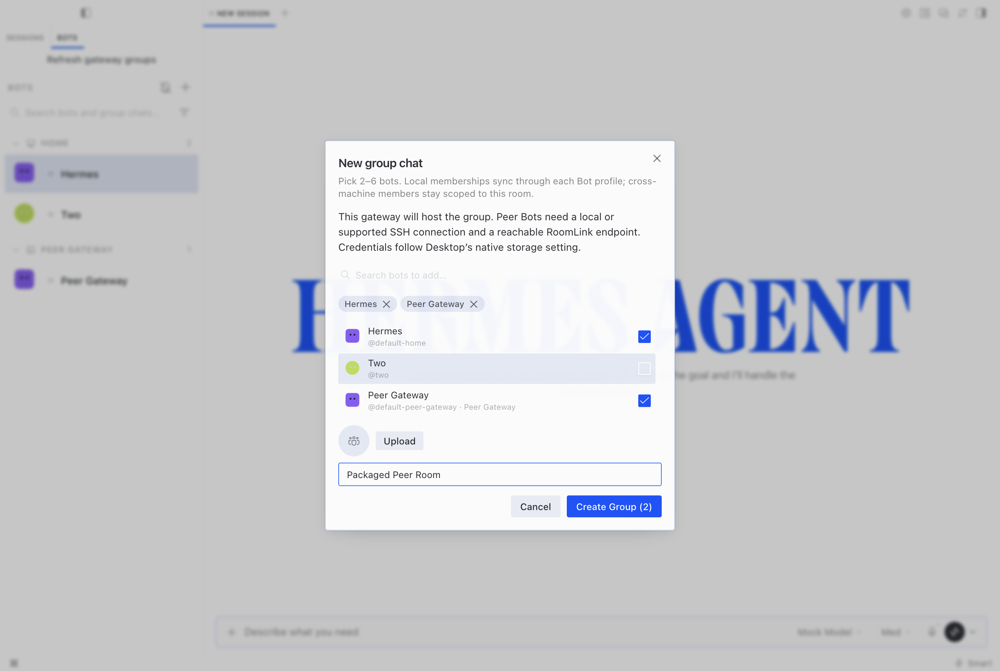
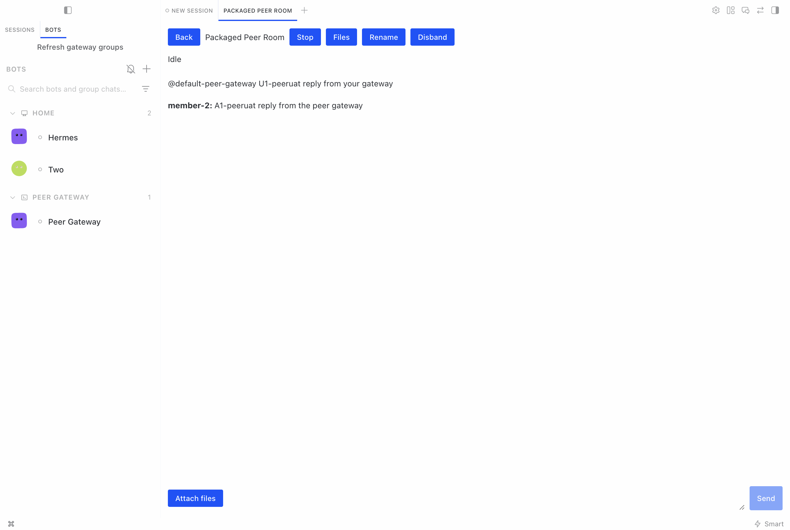
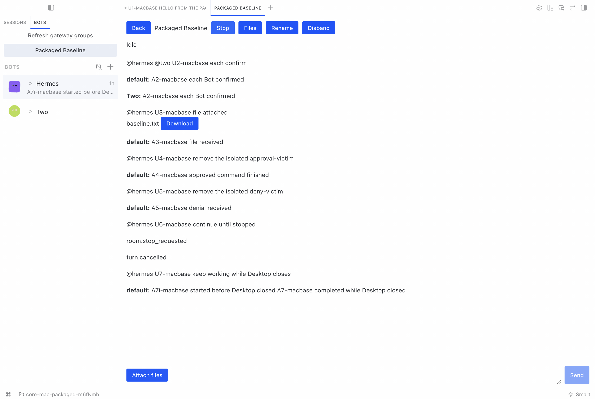
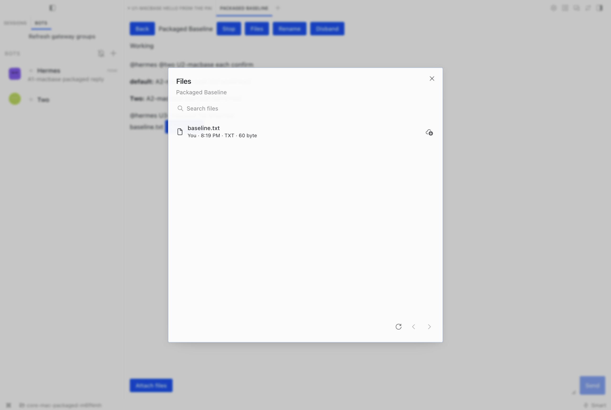
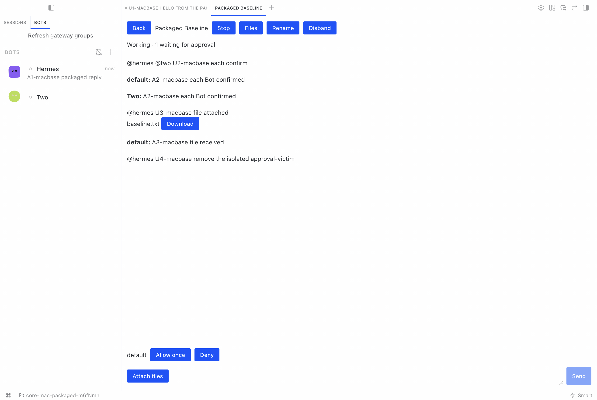
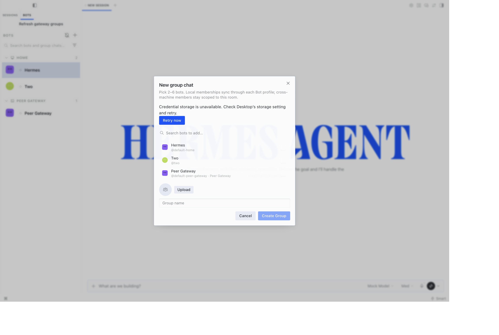

# Packaged Desktop UI acceptance captures

Actual packaged macOS Desktop, explicit matching source-runtime override, real isolated gateways/SSH/storage; only the loopback model is scripted. Native storage policy OFF. No installer provisioning/notarization claim.

These are unedited screenshots of synthetic fixtures, not mockups. Final integration: `3319d75dfd21be40b5fe524c711720ed22b02211`. Earlier Files/approval images retain their original revision.

## 01-native-peer-create.png

Create a gateway-hosted room with Hermes and a Bot from the SSH peer gateway. Credentials follow Desktop’s configured native storage policy.

Tested revision: `3319d75dfd21be40b5fe524c711720ed22b02211`. Relevant PRs: #130790, #98307.

## 02-peer-text-turn.png

The peer gateway executes a text turn and publishes its reply into the shared room.

Tested revision: `3319d75dfd21be40b5fe524c711720ed22b02211`. Relevant PRs: #130790, #98307.

## 03-retained-room-reopened.png

Desktop restores the existing room and work that completed while its viewer was closed, without a manual Refresh action.

Tested revision: `3319d75dfd21be40b5fe524c711720ed22b02211`. Relevant PRs: #130790, #98307.

## 04-room-files-b8e6.png

Room Files shows an uploaded shared file, its sharer, type, size and download action. Captured at b8e6b3a3; the Files UI paths are unchanged at 3319d75d.

Tested revision: `b8e6b3a3289869590519078e2cf108247d06c12b`. Relevant PRs: #98307, #104199.

## 05-room-approval-b8e6.png

A room pauses for approval and offers Allow once or Deny. Captured at b8e6b3a3; the approval workspace and history UI paths are unchanged at 3319d75d.

Tested revision: `b8e6b3a3289869590519078e2cf108247d06c12b`. Relevant PRs: #98307.

## 06-custody-recovery.png

Unreadable setup custody blocks creation and offers Retry now. The controlled recovery test verifies pending cleanup returns to zero.

Tested revision: `3319d75dfd21be40b5fe524c711720ed22b02211`. Relevant PRs: #130790, #98307.

